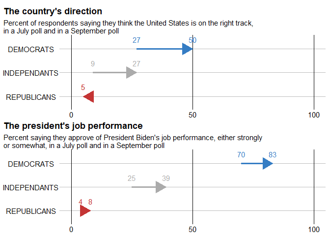
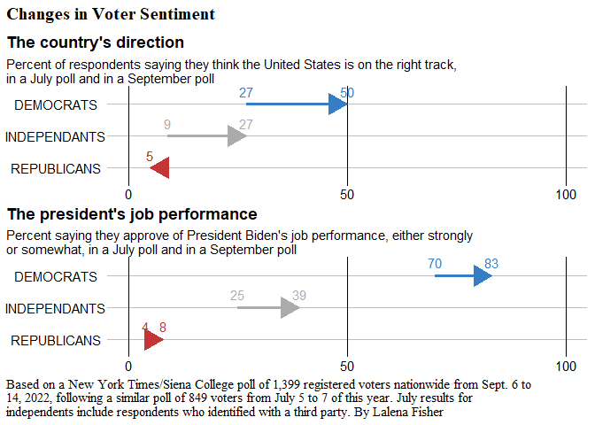

Can it R? Changes in Voter Sentiment
================
Judith Bourque
2022-09-19

This tutorial attempts to recreate the graph featured in the New York
Times article [Democrats Buoyed by Abortion and Trump, Times/Siena Poll
Finds](https://www.nytimes.com/2022/09/16/us/politics/biden-democrats-abortion-trump-poll.html),
by Lisa Lerer and Nate Cohn.

## Tutorial

Create the dataframe by copying the data from the graph.

``` r
library(tidyverse)

# Create columns
question <- c(
  # First question
  "country_direction", "country_direction", "country_direction", "country_direction", "country_direction", "country_direction",
  # Second question
  "president_performance", "president_performance", "president_performance", "president_performance", "president_performance", "president_performance")

group <- c(
  # First question
  "DEMOCRATS", "DEMOCRATS", "INDEPENDANTS", "INDEPENDANTS", "REPUBLICANS", "REPUBLICANS",
  # Second question
  "DEMOCRATS", "DEMOCRATS", "INDEPENDANTS", "INDEPENDANTS", "REPUBLICANS", "REPUBLICANS")

percent <- as.numeric(c(
  # First question
  "27", "50", "9", "27", "5", "5",
  # Second quesiton
  "70", "83", "25", "39", "8", "4"))

date <- as.Date(c(
    # First question
    "2022-07-01", "2022-09-01", "2022-07-01","2022-09-01", "2022-07-01", "2022-09-01",
    # Second question
    "2022-07-01", "2022-09-01", "2022-07-01", "2022-09-01", "2022-07-01", "2022-09-01"))

# Consolidate the columns into a dataframe
df <- tibble(question, group, percent, date) %>% 
  mutate(group = factor(group, levels = c("REPUBLICANS", "INDEPENDANTS", "DEMOCRATS")))

head(df)
```

    ## # A tibble: 6 × 4
    ##   question          group        percent date      
    ##   <chr>             <fct>          <dbl> <date>    
    ## 1 country_direction DEMOCRATS         27 2022-07-01
    ## 2 country_direction DEMOCRATS         50 2022-09-01
    ## 3 country_direction INDEPENDANTS       9 2022-07-01
    ## 4 country_direction INDEPENDANTS      27 2022-09-01
    ## 5 country_direction REPUBLICANS        5 2022-07-01
    ## 6 country_direction REPUBLICANS        5 2022-09-01

Create the top plot in ggplot2.

``` r
# Create a dataframe with relevant data
df1 <- df %>%
  filter(question == "country_direction")

# Create the first plot
p1 <-
  ggplot(df1, aes(x = percent, y = group, colour = group)) +
  # Add thick arrow lines 
  geom_line(size = 1.25) +
  # Add arrow heads
  geom_line(arrow = arrow(ends = "last", type = "closed")) +
  # Adjust line breaks and axis limits
  scale_x_continuous(breaks = c(0, 50, 100), limits = c(0, 100)) +
  # Specify arrow colours
  scale_colour_manual(values = c("#c43535", "#ababab", "#357dc4")) +
  labs(title = "The country's direction",
       subtitle = "Percent of respondents saying they think the United States is on the right track,\nin a July poll and in a September poll") +
  geom_text(aes(label = percent), nudge_y = 0.4) +
  # Start with a blank theme
  theme_void() +
  theme(
    # Show axis ticks text
    axis.text = element_text(),
    axis.title = element_blank(),
    legend.position = "none",
    panel.border = element_rect(size = 1, fill = NA, colour = "white"),
    # Add horizontal lines for groups
    panel.grid.major.y = element_line(colour = "grey"),
    # Add vertical lines for percentage
    panel.grid.major.x = element_line(colour = "black"),
    plot.title = element_text(face = "bold"),
    # Align plot title to the left of the graph
    plot.title.position = "plot"
  )

p1
```

<!-- -->

Create the second plot by replicating the first one with the leftover
data.

``` r
# Create dataframe with relevant data
df2 <- df %>%
  filter(question == "president_performance")

# Create the second plot
p2 <- ggplot(df1, aes(x = percent, y = group, colour = group)) +
  # Add thick arrow lines 
  geom_line(size = 1.25) +
  # Add arrow heads
  geom_line(arrow = arrow(ends = "last", type = "closed")) +
  # Adjust line breaks and axis limits
  scale_x_continuous(breaks = c(0, 50, 100), limits = c(0, 100)) +
  # Specify arrow colours
  scale_colour_manual(values = c("#c43535", "#ababab", "#357dc4")) +
  labs(title = "The country's direction",
       subtitle = "Percent of respondents saying they think the United States is on the right track,\nin a July poll and in a September poll") +
  geom_text(aes(label = percent), nudge_y = 0.4) +
  # Start with a blank theme
  theme_void() +
  theme(
    # Show axis ticks text
    axis.text = element_text(),
    axis.title = element_blank(),
    legend.position = "none",
    panel.border = element_rect(size = 1, fill = NA, colour = "white"),
    # Add horizontal lines for groups
    panel.grid.major.y = element_line(colour = "grey"),
    # Add vertical lines for percentage
    panel.grid.major.x = element_line(colour = "black"),
    plot.title = element_text(face = "bold"),
    # Align plot title to the left of the graph
    plot.title.position = "plot"
  )

p2
```

<!-- -->

Stack the two plots using the `patchwork` plot arithmetic.

``` r
library(patchwork)

p3 <- p1 / p2 

p3
```

<!-- -->

Add a title and a caption with `patchwork::plot_annotation()`.

``` r
p4 <- p3 + plot_annotation(
  title = "Changes in Voter Sentiment",
  caption = "Based on a New York Times/Siena College poll of 1,399 registered voters nationwide from Sept. 6 to \n14, 2022, following a similar poll of 849 voters from July 5 to 7 of this year. July results for \nindependents include respondents who identified with a third party. By Lalena Fisher",
  # Customize the theme using ggplot2::theme()
  theme = theme(
    # Assign a different font to the title and caption
    text = element_text(family = "serif"),
    plot.title = element_text(size = 15, face = "bold"),
    plot.caption = element_text(size = 11, hjust = 0)))

p4
```

<!-- -->

Save the graph with `ggplot2::ggsave()`.

``` r
ggsave("../graph/recreate_graph_voter_sentiment.png")
```
