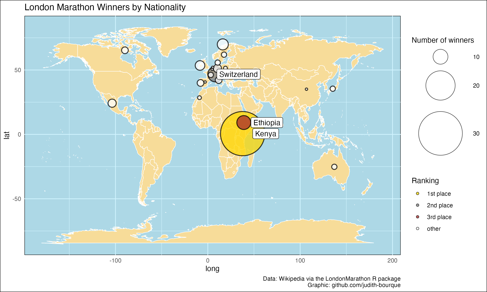
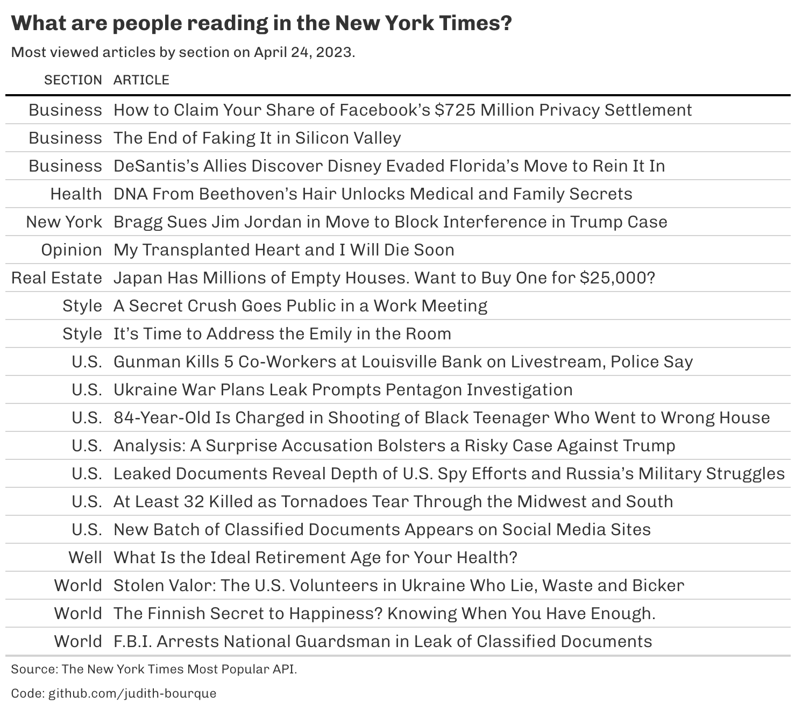
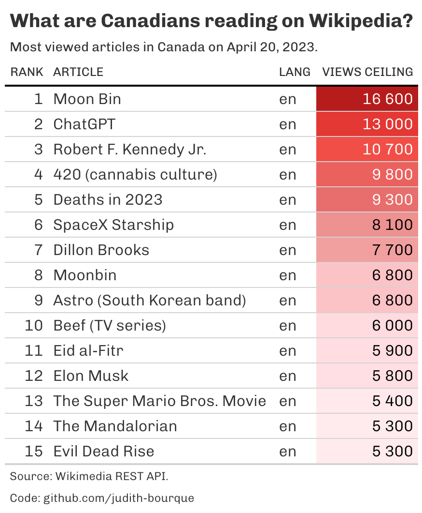
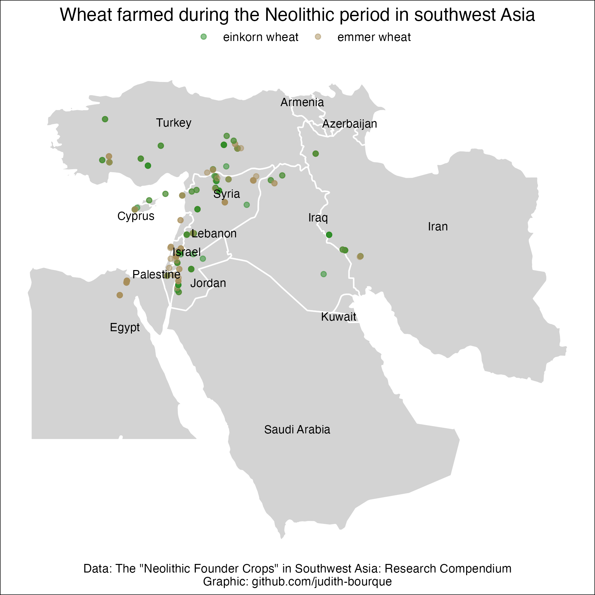
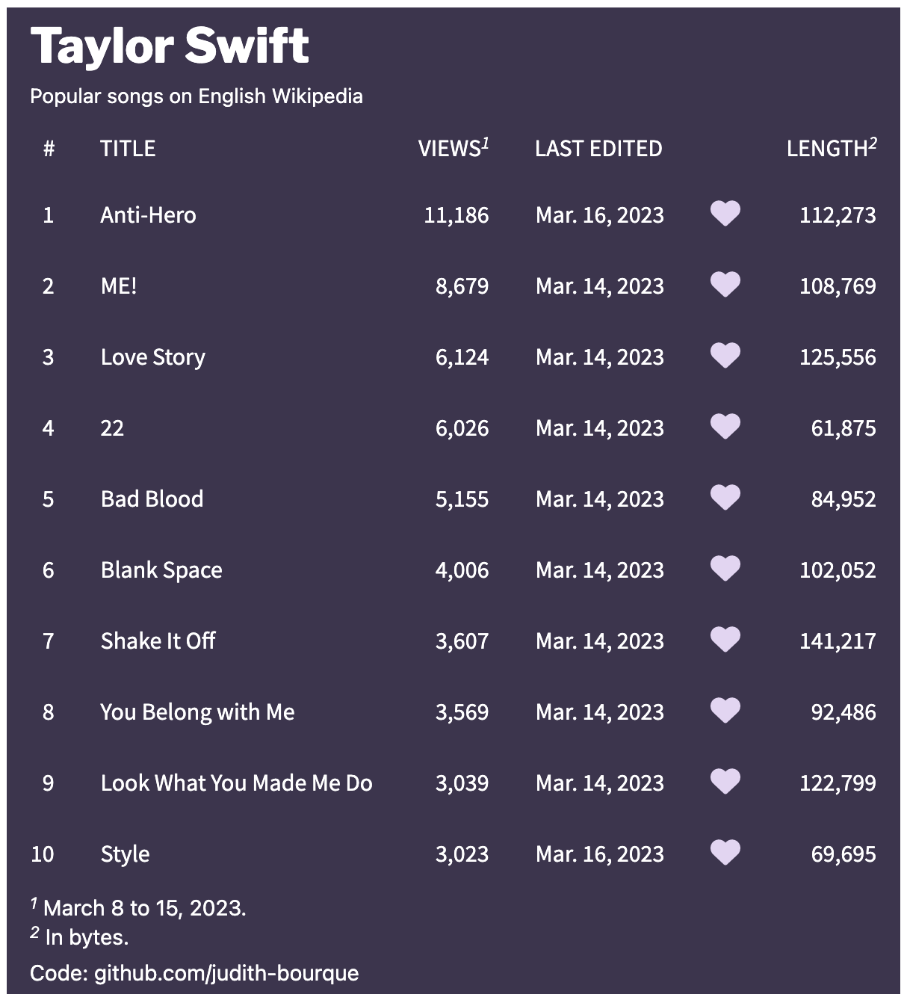
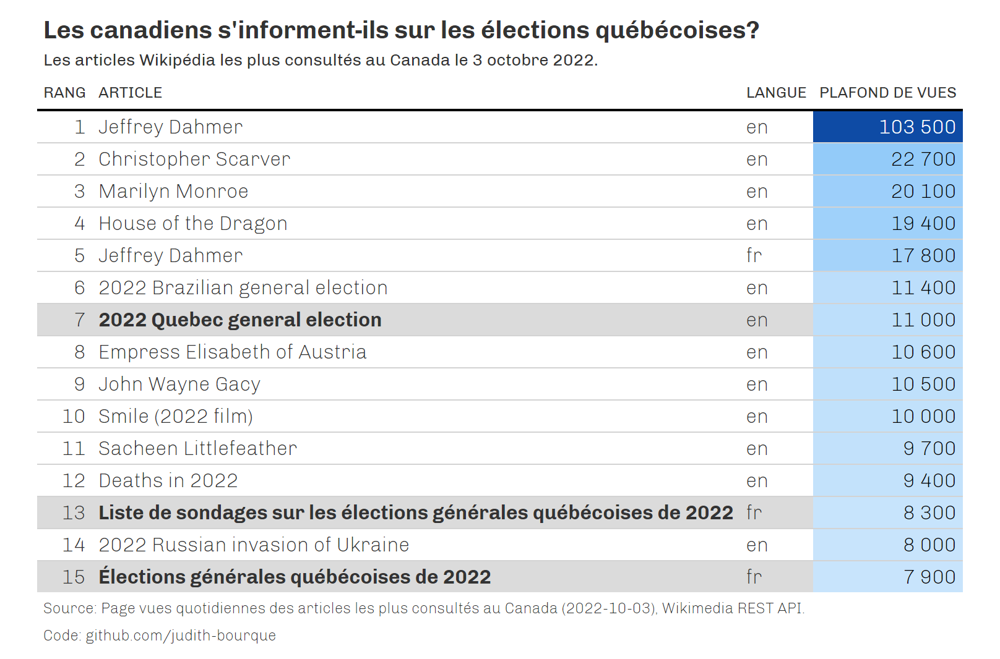

<!-- README.md is generated from README.Rmd. Please edit that file -->

# r-exploration

<!-- badges: start -->
<!-- badges: end -->

The goal of r-exploration is to …

# r-exploration

Exploratory data analysis in R

## About this repository

This repository provides the codes and the graphs produced through
experimentation with R.

## Recent graphs

### London Marathon Winners

### Most viewed articles in the New York Times

### Top Read Wikipedia Articles in Canada

### Wheat farmed during the Neolithic period

### Popular Taylor Swift Songs on Wikipedia

### Quebec Elections: Top Read Wikipedia Articles in Canada

### Recreate graph: Changes in Voter Sentiment

### Top read Wikipedia articles in Canada

### Top read Wikipedia articles about Quebec

### Wikipedia pageviews for National Acadian Day

### Wikipedia pageviews by article for FEQ headliners

### Wikipedia pageviews for Category:Musicians from New Brunswick

