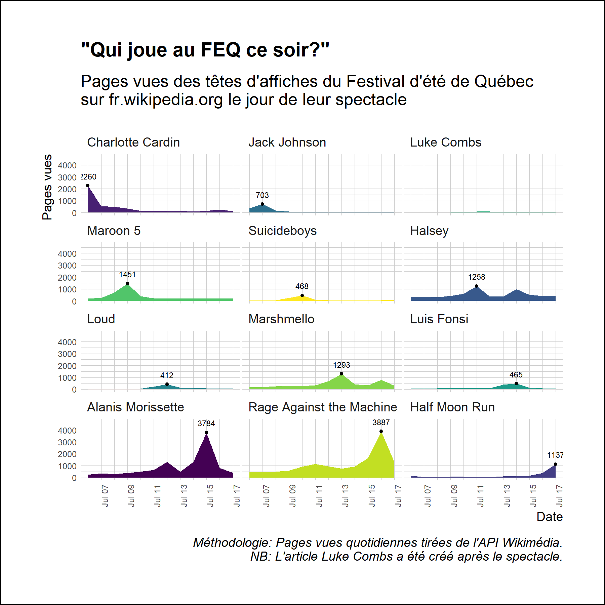

# r-exploration
Exploratory data analysis in R

## About this repository

This repository provides the codes and the graphs produced through experimentation with R.

## Recent graphs

### Popular Taylor Swift Songs on Wikipedia

### Quebec Elections: Top Read Wikipedia Articles in Canada

### Recreate graph: Changes in Voter Sentiment

### Top read Wikipedia articles in Canada

### Top read Wikipedia articles about Quebec

### Wikipedia pageviews for National Acadian Day

### Wikipedia pageviews by article for FEQ headliners

### Wikipedia pageviews for Category:Musicians from New Brunswick

